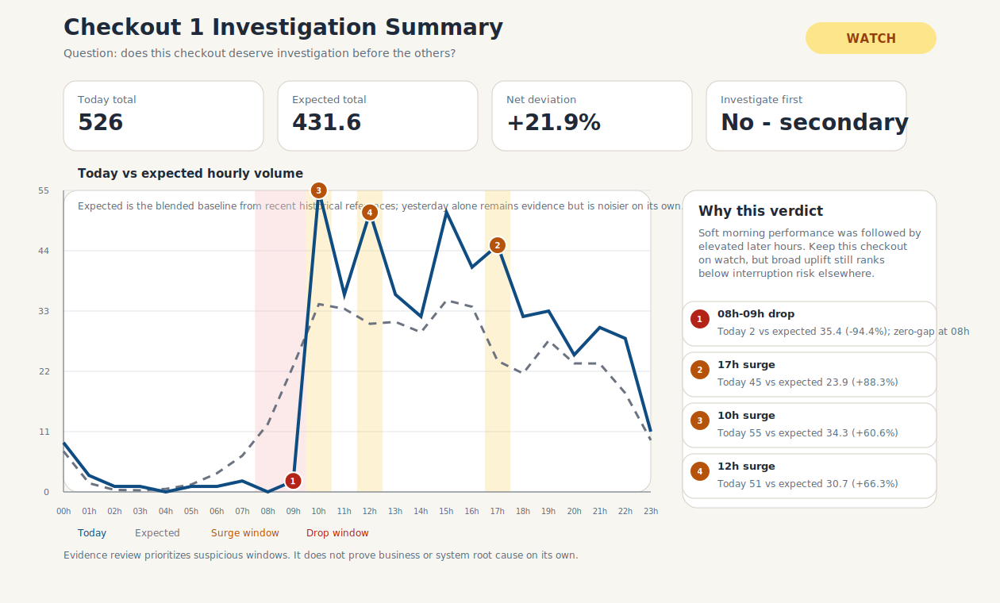
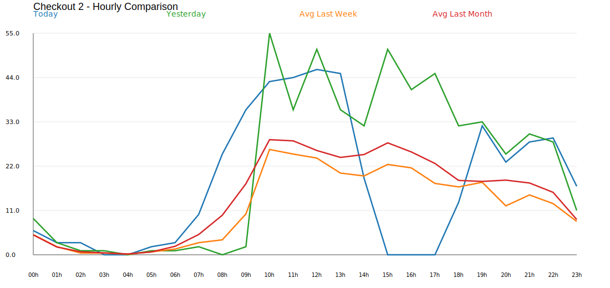

# CloudWalk Monitoring Analyst Challenge

## Anomaly detection and transaction alerting

Reviewer presentation for the CloudWalk monitoring analyst challenge.

Evidence in this deck comes from:

- `database/` source CSVs
- `database/report/` generated anomaly tables
- `charts/` generated checkout visualizations
- `grafana/` dashboard configuration
- FastAPI monitoring and decision endpoints

---

# The Problem

CloudWalk needs a monitoring workflow that can:

- identify unusual checkout behavior against historical hourly references
- detect abnormal denied, failed, and reversed transaction rates
- return an alert recommendation through an API
- report formal alerts automatically to an operations-facing channel
- explain the evidence clearly enough for a reviewer or operator to act

The challenge is not only detection. It is also deciding which anomalies matter enough to interrupt a team.

---

# Challenge 3.1: Checkout Investigation

The first task is an investigation, not just a chart export:

- which checkout should be investigated first
- what evidence supports that prioritization
- what should an analyst check next before claiming root cause

Ranking is based on structural interruption risk, not on whichever checkout moved furthest for the full day.
Multi-hour zero-gap drops outrank broad uplift.

The first-challenge evidence set is the checkout CSVs, the SQL-style anomaly outputs, and the generated SVG charts.
The FastAPI service, alerting flow, and Grafana dashboard answer the second task and help validate runtime behavior, but they are not the basis for the checkout conclusion.

Primary reviewer entrypoint:

```bash
./scripts/reviewer_start.sh
```

This one-step bootstrap regenerates the checkout anomaly CSV/SVG artifacts, starts API + Grafana + mock team receiver, and runs smoke checks before printing first-login details.
Manual compose/local paths remain fallback options in `README.md` and are not the primary reviewer flow.

---

# Evidence Map

Canonical data:

- `database/checkout_1.csv`
- `database/checkout_2.csv`
- `database/transactions.csv`
- `database/transactions_auth_codes.csv`

First-challenge evidence set:

- `database/report/checkout_1_anomaly.csv`
- `database/report/checkout_2_anomaly.csv`
- `sql/checkout_1_anomaly.sql`
- `sql/checkout_2_anomaly.sql`
- `charts/checkout_1.svg`
- `charts/checkout_2.svg`

Second-challenge runtime support:

- `grafana/dashboard.json`
- FastAPI monitoring and decision endpoints

Supporting narrative:

- `report/technical_report.md`

Runtime logs are not used as canonical evidence because smoke tests and manual replays can append synthetic alert records.
The checkout anomaly CSVs and SVGs support the first challenge writeup; the Grafana dashboard panels are sourced from monitoring API endpoints backed by the transaction datasets.

---

# Checkout Findings

`checkout_2` should be investigated first.

- `08h`: 25 today vs 8.51 expected, +193.77%
- `09h`: 36 today vs 18.26 expected, +97.15%
- `15h`, `16h`, and `17h`: 0 today against material expected volumes

This is the strongest structural anomaly in the checkout data because it combines an early surge with a later interruption.
Priority comes from interruption risk, not from having the biggest full-day net deviation.

`checkout_1` is secondary and remains `watch`, not `recovering`:

- total today: 526 vs 431.58 expected, +21.88%
- weak morning hours at `08h` and `09h`
- stronger later hours at `10h`, `12h`, `17h`, and `22h`

That keeps `checkout_1` abnormal enough to watch, but it does not show the same zero-gap interruption pattern.
`Expected` is a blended baseline because yesterday remains useful evidence but is noisier when used alone.

Chart evidence:



---

# Why Checkout 2 Comes First

`checkout_2` shows a morning surge followed by a sharp afternoon gap.

This pattern is more investigation-worthy than simple uplift because the ranking rule prioritizes structural interruption risk, and it combines:

- a demand surge at `08h` and `09h`
- continued strength before the interruption
- complete dropouts at `15h`, `16h`, and `17h`

This prioritization does not prove root cause. It says `checkout_2` has the clearest evidence for first follow-up.

Next questions for an analyst:

- did a routing, staff, or terminal change happen before `15h`
- was there a payment-provider or ingestion issue during the zero-gap window
- did traffic move to another checkout rather than disappear outright



---

# Challenge 3.2: Runtime Monitoring And Alerting

# Transaction Baseline
The transaction dataset is continuous and internally consistent:

- data range: `2025-07-12 13:45:00` to `2025-07-15 13:44:00`
- minute buckets: 4,320
- total transactions: 544,320
- approved transactions: 504,622
- overall approval rate: 92.7%

Overall status mix:

- denied: 29,957, about 5.5%
- reversed: 4,241, about 0.8%
- failed: 270, about 0.05%

The case is therefore not a full-system outage. It is concentrated abnormal behavior inside otherwise healthy traffic.

---

# Incident Shape

Before cooldown, the dataset contains:

- 315 warning or critical minutes
- 213 denied-related alertable minutes
- 68 reversed-related alertable minutes
- 37 failed-related alertable minutes

If the full dataset is replayed through cooldown rules:

- 166 formal alerts would be emitted
- 136 warning alerts
- 30 critical alerts

Denied behavior dominates the incident surface. Failed and reversed spikes are real but smaller and more localized.

---

# Denied Incidents

The strongest denied episodes point to issuer/customer payment friction.

Key episodes:

- `2025-07-13 21:20-21:58`: 753 denied out of 2,941, about 25.6%, dominated by auth code `59 Suspected fraud`
- `2025-07-13 08:38-09:17`: 682 denied out of 2,503, about 27.2%, dominated by auth code `51 Insufficient funds`
- `2025-07-12 17:09-17:24`: 534 denied out of 1,773, about 30.1%, dominated by auth code `51`

Anchor minute:

- `2025-07-12 17:18`: 54 denied out of 149, denied rate 36.24%

---

# Failed And Reversed Incidents

Failed spike:

- `2025-07-15 04:30`: 10 failed out of 115
- failed rate: 8.70%
- likely owner: platform/gateway engineering
- interpretation: processor, application, or network instability

Reversed spikes:

- `2025-07-14 01:53`: 7 reversed out of 131
- `2025-07-14 06:33`: 7 reversed out of 141
- likely owner: finance/reconciliation ops
- interpretation: reconciliation, settlement, or duplicate-processing issue

These incidents are material, but the denied episodes are the largest business-impact pattern.

---

# Alert Model

The alert model is deterministic and baseline-aware:

- baseline: previous 60 complete minutes
- minimum total volume: 80 transactions
- minimum metric count: 3 denied, failed, or reversed events
- warning threshold: max configured floor, baseline x 2.0
- critical threshold: max(configured floor x 1.5, baseline x 3.0)
- cooldown: suppress repeated metric + severity alerts for 10 minutes

This keeps the system sensitive to real spikes while reducing noise from low-volume minutes.

---

# Dashboard Decision State

The current focused dashboard state is normal.

Latest focused minute:

- timestamp: `2025-07-15 13:44:00`
- denied rate: 6.43%
- denied baseline: 5.01%
- estimated excess denied transactions now: about 2
- forecasted denied rate within 30 minutes: 7.02%

Interpretation:

- there is mild denied elevation
- it remains below formal warning threshold
- no immediate action is required at the latest dashboard focus point

---

# Operational Controls

The implementation protects the reviewer runtime with:

- localhost-only Docker port bindings
- optional API key on monitoring endpoints, metrics endpoints (`/metrics`, `/metrics/recent`, `/metrics/focus`), alerts, and decision endpoints (`/decision`, `/decision/focus`, `/decision/forecast/focus`)
- request body size limits
- count and auth-code validation
- aggregate-only alert metadata
- webhook delivery status reported separately from alert detection

Runtime log files under `logs/` are operational artifacts. They are useful for local checks, but not the source of truth for the case findings.

---

# Follow-Up

This investigation supports a clear triage order:

- `checkout_2` should be investigated first
- `checkout_1` should stay on watch as a secondary checkout issue
- transaction monitoring remains the second-challenge runtime layer for real-time alerting and operator guidance

What this evidence supports:

- checkout anomalies are reproducible from SQL-style baseline comparisons
- the checkout charts identify which window deserves first follow-up
- transaction alerting catches denied, failed, and reversed behavior above normal
- Grafana focus endpoints and `/decision` outputs translate raw rates into reviewer-facing action guidance

What this evidence does not prove:

- the exact business or system root cause behind the checkout interruption
- whether the `15h`-`17h` gap was routing, operational, or data-collection related

Bottom line: the monitoring workflow prioritizes business-relevant smoke without pretending every anomaly is already explained.
